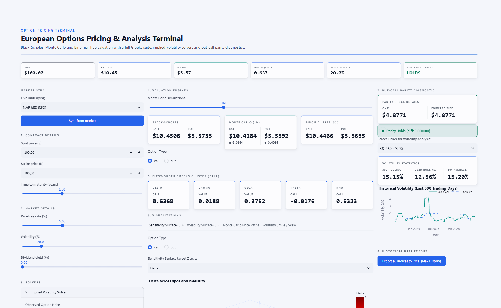
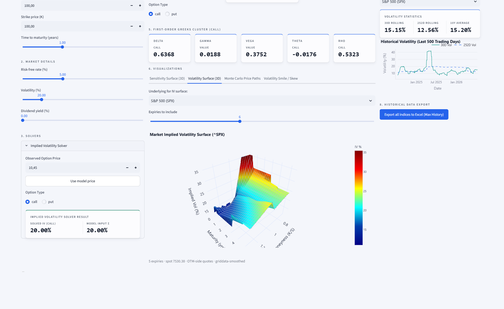

# Option Pricing Terminal

[](https://github.com/DimitrisKotoulias/option-pricing-terminal/actions/workflows/ci.yml)
[](https://www.python.org/)
[](#testing)
[](#testing)
[](https://github.com/psf/black)
[](LICENSE)

**A European options pricing desk in the browser.** Three valuation engines behind one
interface, a full Greeks suite cross-checked against finite differences, implied-volatility
solvers, and a market implied-volatility surface built from live option chains.



```python
from optpricing import BlackScholesModel, MonteCarloOptionPricer, BinomialTreeModel

BlackScholesModel(S=100, K=100, T=1, r=0.05, sigma=0.2).call_price()   # 10.4506
MonteCarloOptionPricer(100, 100, 1, 0.05, 0.2, n_simulations=500_000, seed=42) \
    .call_price(return_std_error=True)                                 # 10.4557 ± 0.0148
BinomialTreeModel(100, 100, 1, 0.05, 0.2, n_steps=1000).call_price()   # 10.4486
```

Three independent methods, agreeing on an at-the-money call to within ~0.005.

---

## The volatility surface

The headline feature: point the terminal at an underlying and it pulls the whole listed
term structure, solves Black-Scholes implied volatility for every liquid strike, and
assembles a smoothed `moneyness × maturity` surface.



What makes it a *market* surface rather than a pretty mesh:

- **OTM side only** — calls at/above spot, puts below, the standard market convention,
  avoiding the wide bid/ask of deep in-the-money quotes.
- **Per-expiry true maturity** — each expiry is solved at its own `T`, not one blanket
  maturity across the whole chain. Expiries that have already passed are *rejected*,
  never floored to one day.
- **Robust wing trimming** — a median ± 4·MAD filter per expiry drops illiquid deep-OTM
  outliers while keeping genuine smile curvature.
- **It cannot invent volatility.** The smoothed mesh is held inside the band the market
  actually quoted. Real chains pack dozens of strikes into a razor-thin near-expiry
  slice, which gives the cubic (Clough-Tocher) interpolant near-degenerate triangles and
  wild gradients — measured overshoot to **7734% IV** against quotes topping out at 112%.
  Cubic is now accepted only when it stays inside the observed band; otherwise the
  piecewise-linear interpolant, which cannot overshoot, is used.

---

## Features

- **Three pricing models** behind a shared `OptionPricingModel` interface:
  - `BlackScholesModel` — closed form, with continuous dividend yield.
  - `MonteCarloOptionPricer` — risk-neutral simulation with **antithetic variates** and
    *statistically correct* standard errors. Antithetic draws are not i.i.d., so the
    error is computed from the `N/2` pair means, not `std(all)/√N`.
  - `BinomialTreeModel` — vectorised Cox-Ross-Rubinstein with optional American exercise,
    and a no-arbitrage guard that raises rather than returning a silently wrong price.
- **Greeks** — first order (delta, gamma, vega, theta, rho) and second order (vanna,
  vomma, charm), every one cross-checked against a central finite difference. Second-order
  Greeks are built on *raw* vega so their scaling stays internally consistent.
- **Implied volatility** — scalar Brent and Newton-Raphson solvers, plus a **vectorised
  Newton** that inverts an entire strike vector at once, all with no-arbitrage guards that
  return `None`/`NaN` instead of a meaningless root.
- **Live market data** — yfinance-backed spot, option chains, a Treasury yield curve
  interpolated to each maturity, dividend yields and realised volatility. Cached to disk
  and degrading gracefully offline.
- **Put-call parity** — verification, implied forward price, and explicit arbitrage
  detection with the offsetting strategy.
- **Tested** — 111 tests, all offline and deterministic; core pricing and analytics modules
  sit at 90–100% line coverage (84% overall, network I/O aside), with a CI floor of 80%.

## Install

```bash
pip install -e .                    # core library
pip install -e ".[dev]"             # + pytest / coverage / black / ruff
pip install -e ".[viz,app,data]"    # + plotting, dashboard, live market data
```

The core library runs on **Python 3.9+**. The dashboard extra (`app`) needs
`streamlit>=1.58` and therefore **Python 3.10+**.

## Run the terminal

```bash
pip install -e ".[app,data]"
streamlit run app/streamlit_dashboard.py
```

**Sync from market** auto-fills spot, rate, dividend yield and volatility from live data.
All three engines price side by side with a live Greeks cluster and an implied-vol solver,
alongside four visualisations — 3D sensitivity surface, 3D volatility surface, Monte Carlo
price paths, and the volatility smile/skew — plus put-call-parity diagnostics and a
historical-data Excel export.

## Project structure

```
src/optpricing/
  pricing/    base_model, black_scholes, monte_carlo, binomial_tree
  analytics/  greeks, greeks_numerical, implied_volatility,
              volatility_surface, put_call_parity
  data/       market_data_fetcher (yfinance + on-disk cache), quotes
  utils/      visualization
tests/        one module per component (pytest, 111 tests, all offline)
app/          streamlit_dashboard.py + theme / tabs / panels / data helpers
scripts/      market_validation.py, export_historical_excel.py
docs/         mathematical_background.md, images/
notebooks/    planned-analysis roadmap (see notebooks/README.md)
```

`pricing` and `analytics` re-export their public classes, so `from optpricing import
BlackScholesModel, Greeks` works. `data` and `utils` intentionally do **not** — import them
explicitly. This keeps `import optpricing` free of the optional `data`/`viz` dependencies.

## Testing

```bash
pytest --cov=optpricing --cov-report=term-missing
```

Every test runs offline and deterministically: market-data helpers are monkeypatched, and
the volatility-surface tests build synthetic Black-Scholes chains at a known sigma and
assert the surface recovers it.

## Math

See [`docs/mathematical_background.md`](docs/mathematical_background.md) for the
derivations, the desk-quoting scaling conventions, and the variance-reduction note.

## Roadmap

- Worked analysis notebooks fleshing out the outline in `notebooks/README.md`.
- Batch market validation against index and equity chains (`scripts/market_validation.py`
  already does this for SPX / NDX / RUT).
- Stochastic-volatility (Heston) and jump-diffusion (Merton) extensions.

## License

MIT — see [LICENSE](LICENSE).
